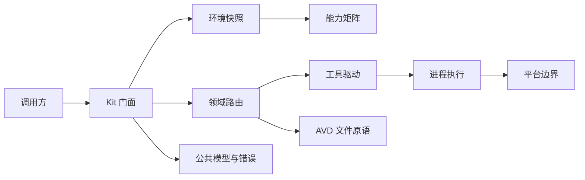

# 架构

本文解释代码为什么这样分层，以及一次调用如何从公开 API 到达 Android 官方工具。后续章节都建立在这里的分层和术语之上，建议按文件编号连续阅读。

## 心智模型

avdkit 不是 Android CLI 的参数转发器。它在调用官方工具之前先回答三个问题：

1. 当前主机有哪些工具和路径？
2. 这个操作现在能否执行，不能时缺什么？
3. 调用方是否允许这个操作产生相应副作用？

真正执行时，领域操作再选择工具、构造命令、验证输出，并把工具特有结果转换为稳定的公共模型。



例如，查询预设机型时：

1. `Kit.profiles()` 检查 `devices_profiles` 能力。
2. 环境快照给出 Android CLI 路径、SDK 路径和 Android 用户目录。
3. `drivers` 构造 `android --sdk=<SDK> emulator create --list-profiles`。
4. `process` 负责超时、输出捕获和进程组清理。
5. 驱动验证输出格式，`core` 将 ID 转换为 `Profile`。

## 分层

### 公共契约：`model`

`model` 定义所有出口共用的记录、枚举、错误码、能力和计划。这里的类型可以序列化，但不执行 I/O，也不依赖 workspace 中的其他 crate。

字段进入 `model`，意味着 Rust、CLI JSON 和语言绑定要共享它的语义。工具临时输出不应直接进入这一层。

### 平台与执行原语：`platform`、`process`、`avdfs`

- `platform` 是唯一可以处理目标操作系统差异的 crate。默认路径、可执行文件名和进程组行为都集中在这里。
- `process` 执行短生命周期子进程，统一处理环境变量、stdin、stdout、stderr、超时和取消。
- `avdfs` 读取和改写 AVD 文件。INI 原语保留未知行、键顺序以及值中的 `=`。

这三层不知道“创建设备”或“启动模拟器”等领域意图。

### 官方工具适配：`drivers`

每个官方可执行文件对应一个驱动。驱动负责：

- 按工具版本构造命令；
- 清洗并解析输出；
- 声明成功特征；
- 将已知失败映射为稳定错误码。

驱动不决定一个领域操作应该优先使用哪个工具，也不组合多个步骤。详见[工具驱动](04-tool-drivers.md)。

### 环境与能力：`env`

`env` 探测一次主机，生成不可变的 `EnvironmentSnapshot`，再从快照推导 `CapabilityMatrix`。

快照避免一次操作中途因为环境变量或 PATH 变化而使用不同工具。调用 `Kit.refresh()` 才会重新探测并整体替换快照。

能力只描述静态条件，例如平台和工具是否可用。设备是否正在运行、名称是否冲突等请求相关条件由操作预检处理。

### 领域门面：`core`

`core` 暴露线程安全的 `Kit`：

- 查询直接异步返回数据；
- 长任务返回可观察、可取消的 `Operation`；
- 组合操作先编译为可序列化的 `Plan`。

工具选择、预检、计划补偿和公共模型转换都属于这一层。Rust 调用方只需要依赖包 `avdkit`，不需要直接依赖内部 crate。

### 出口：`cli`、`ffi`

`cli` 将 `Kit` 映射为人类可读输出和带 `schema_version` 的 JSON。当前提供环境、能力、刷新、AVD 文件设备列表与详情，以及预设机型查询。

`ffi` 是语言绑定边界。正式 UniFFI 导出尚未接入；跨语言 async、取消和 XCFramework 已通过独立实验验证。

## 依赖规则

依赖始终从出口和领域层指向基础层，不能反向引用：

```text
cli / ffi → core
core      → env, drivers, avdfs, process, model
env       → platform, model
drivers   → process, model
avdfs     → model
process   → platform, model
platform  → model
model     → 无 workspace 依赖
```

额外约束：

- `model` 不依赖任何 workspace crate；
- 每个内部 crate 只声明实际使用的依赖，避免层次边界随 Cargo 依赖图漂移；
- 目标操作系统条件分支只出现在 `platform`；
- `drivers` 不依赖 `core`，避免把领域策略写进工具解析；
- 所有出口复用 `model`，不各自发明错误和字段。

## 当前可运行范围

当前真正贯通公开出口的功能是：

- 环境探测；
- 能力查询；
- 环境刷新；
- Android CLI 预设机型查询；
- AVD 文件设备列表与详情；
- 创建计划编译，不执行计划。

其他公开入口会返回结构化的 `capability_unavailable`，而不是空结果或挂起的任务。

## 阅读顺序

1. [策略](01-policy.md)：能力、策略和预检如何共同决定行为。
2. [公共 API](02-public-api.md)：如何创建 `Kit`、查询能力和处理错误。
3. [进程执行](03-process-execution.md)：取消和外部进程生命周期。
4. [工具驱动](04-tool-drivers.md)：官方工具的不一致如何被隔离。
5. [只读查询](05-read-only-queries.md)：一个已经跑通的端到端示例。
6. [设备文件查询](06-device-files.md)：不依赖工具输出读取 AVD 列表与详情。
